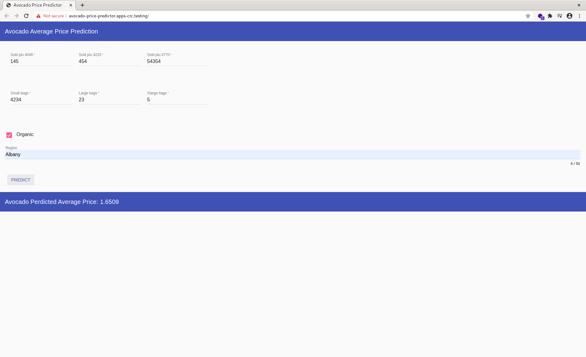

# Avocado Price Predictor
Web Application to predict avocado average price using [Machine Learning](https://github.com/shaySirek/avocado-price-predictor-model).

# What is about? 
- [Kaggle Dataset](https://www.kaggle.com/neuromusic/avocado-prices)
- [Task](https://www.kaggle.com/neuromusic/avocado-prices/tasks?taskId=3524)

---

---
# Installation
Run `pip3 install -r requirements.txt`

# Testing
Run `tox`

# Running
Run `./manage.py runserver`
